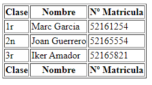

# 0373-Apuntes-IzanIzquierdo
### Apuntes de lenguaje de marcas

# GIT
Para crear un nuevo repositorio nos situamos en nuestro perfil en el apartado `Repositories` y clicamos en `New`.  


En el apartado de la creación podremos importar un repositorio con el codigo de otro clicando en `Import a repository` o crear uno de 0.  
Para crearlo agregaremos un nombre de repositorio, definiremos quien puede ver nuestro repositorio `Public o Private` y añadiremos un archivo readme clicando en la casilla `Add a README file` en caso de necesitarlo. Ahora simplemente le damos a `Create repository` y ya tendriamos el repositorio.


Una vez tengamos el repositorio acabado, lo subiremos a traves de Github pages.  
Para hacer esto tendremos que dirigirnos a la configuración `Settings`, luego al apartado `Pages` y seleccionar la rama que queramos subir, en este caso sera `main`.
La seleccionamos, guardamos clicando en `Save` y esperamos unos minutos.


En un par de minutos ya tendremos nustra pagina web subida.


Por último, si queremos trabajar con el repositorio en local, tendremos que dirigirnos a `Code` y copiar el HTTPS que luego pegaremos en local.


Para clonar un repositorio de Github en local copiaremos el codigo del repositorio y lo pegaremos en el terminal:  


Para subir los archivos a Github, tendremos que poner los siguientes comandos:

- Inicializaremos el repositorio de `Git`


- Selecciona la rama a la que queremos subir


- Selecciona lo que queremos subir, en este caso ponemos `.` para seleccionar todo  


- Enviamos las actualizaciones que hemos hecho del repositorio `commit` y le damos un nombre a la version `-m`  


- Subimos el repositorio a Github  


# MARKDOWN

## Estilos de letra:
Para cambiar los estilos en Markdown usaremos asteriscos `*` y guiones bajos `_` 
Estos estilos se pueden combinar  


*Cursiva*

**Negrita**

***Combinado***

## Encabezados:
Para crear encabezados en Markdown usamos las almohadillas `#`, añadiendo 1 por cada nivel hasta un maximo de 6.  
Puedes cerrar los encabezados añadiendo el mismo numero de almohadillas al final.  
Los encabezados tienen un estilo asociado por defecto.

 # #Encabezado 1
 ## ##Encabezado 2
 ### ###Encabezado 3
 #### ####Encabezado 4
 ##### #####Encabezado 5
 ###### ######Encabezado 6

## Parrafos y Saltos de linea:
Para generar un nuevo párrafo en Markdown simplemente separa el texto mediante una línea en blanco (pulsando dos veces intro)

Markdown no soporta dobles líneas en blanco, así que si intentas generarlas estas se convertirán en una sola al procesarse.  
Para realizar un salto de línea y empezar una frase en una línea siguiente dentro del mismo párrafo, tendrás que pulsar dos veces la barra espaciadora antes de pulsar una vez intro.


## Imagenes

### Imagen en linea  
Las imagenes en linea estan compuestas por una exclamación `!` para definir que estas haciendo una imagen, un texto alternativo `[]` y la dirección `()`:
``

### Imagen de referencia  
Las imagenes de referenciaa estan compuestas por una exclamación `!` para definir que estas haciendo una imagen, un texto alternativo `[]` y la referencia `[]`.
Y donde queramos añadir la imagen pondremos el nombre de la referencia `[]` la dirección `:https//` y el texto alternativo `""`:
`![TextoAlternativo][NombreReferencia]
[NombreReferencia]:Link"TextoAlternativo"
`

## Enlaces
Los enlaces estan compuestos por el texto que contendra el link `[]`, el link `()`.  
`[Link](https://ejemplo.com/ "Título opcional del enlace")`  
[Link](https://google.com/)


## Listas:

### Listas ordenadas:
1. Para crear una lista ordenada usamos `numero.` Ej.: 1.
    1. Las listas se pueden anidar o combinar añadiendo 4 espacios antes del siguiente
5. El numero de la lista no es necesario que sea consecutivo ya que el numero cambia segun en la posición en la que se encuentre

### Listas desordenadas:
- Para crear una lista desordenada podemos usar: guion `-`, suma `+` o asterisco `*`
+ El simbolo usado para crear la lista no importa ya que todos se veran igual al procesarse
    * Estas listas tambien se pueden anidar o combinar


## Tablas
-Para crear las filas usaremos las barras verticles `|` entre una y otra
-Para crear un encabezado, debajo de este añadiremos una columna con las mismas filas separadas con `|` y en vez de texto, pondremos 2 o mas guiones `--`. En esta separación, podremos definir la alineación de las columnas con `:`
-Para añadir mas columnas simplemente seguiremos con la misma estructura (no hace falta que las columnas esten alineads verticalmente)

Ej:  
```
|Columna1|Columna2|Columna3|
|:--|--|--:|
|Texto1|Texto2|Texto3|
```
|Columna1|Columna2|Columna3|
|:--|--|--:|
|Texto1|Texto2|Texto3|


## Codigo
El codigo se tiene que introducir dentro de accentos graves '` `` `'.

`codigo`

Para crear un bloque que contenga codigo, este se ha de incluir entre tres accentos graves '` ``` `'.

```
codigo
```


# HTML

**html**: Define el comienzo y el final de un documento HTML. Todo el contenido de la página web debe estar contenido dentro de esta etiqueta.

**head**; Contiene información sobre el documento, como el título de la página, metadatos, enlaces a hojas de estilo y otros elementos que no se muestran en la página.

**title**: Define el título de la página, que se muestra en la barra de título del navegador.

**meta**: Se utiliza para incluir metadatos en el documento, como el conjunto de caracteres utilizado y la descripción de la página.

**link**: Permite vincular a hojas de estilo externas, iconos y otros recursos relacionados con la página.

**style**: Se utiliza para incluir hojas de estilo CSS directamente en el documento HTML.

**script**: Se utiliza para incluir scripts JavaScript en la página web. Puede estar ubicado en la sección **head** o al final del cuerpo (**body**) para mejorar el rendimiento de carga.

**body**: Contiene el contenido visible de la página, como texto, imágenes, enlaces y otros elementos.

**h1, h2, h3, h4, h5, h6**: Definen encabezados de diferentes niveles, siendo **h1** el más alto y **h6** el más bajo. Estos se utilizan para estructurar el contenido y mejorar la accesibilidad.

**p**: Define un párrafo de texto.

**a**: Crea enlaces a otras páginas web o recursos. El atributo href especifica la URL de destino.

**img**: Inserta imágenes en la página web. El atributo src define la ubicación de la imagen.

**ul y ol**: Se utilizan para crear listas no ordenadas (viñetas) y listas ordenadas (números o letras), respectivamente. Los elementos de lista se definen con li.

**div**: Se utiliza para crear contenedores o divisiones en la página. Es comúnmente usado para aplicar estilos o estructurar el contenido.

**table**: Crea tablas en la página web. Se utiliza junto con etiquetas como **tr** (fila), **th** (encabezado de columna) y **td**(celda de datos) para definir la estructura de la tabla.

**form**: Define un formulario que permite a los usuarios enviar datos al servidor.

**input**: Se utiliza para crear campos de entrada de texto, casillas de verificación, botones de radio y otros elementos de formulario.

**select**: Crea listas desplegables de selección en formularios.

Estos son unos de los atributos mas utilizados en html.

```
witdh=""
class=""
type=""
id=""
alt=""
href=""
```

Ejemplo de HTML
```html
<!DOCTYPE html>
<html lang="en">
    <head>
        <meta charset="UTF-8">
        <meta http-equiv="X-UA-Compatible" content="IE=edge">
        <meta name="viewport" content="width=device-width, initial-scale=1.0">
        <title>En el head se pone todo lo no visible en la pagina</title>
    </head>
    <body>
        <h1>Apuntes</h1>
        <p class="">contenido</p>
        
        <br>
        <h4>Etiqueta de bloque</h4>
        <p>La P, cuando se dejan de utilizar hace un intro</p>
        <h4>Etiqueta de Titulo</h4>
        <p>La a, se pueden poner enlaces, tambien se pondria estilos, imagenes...</p>
        <a>
    </body>
</html>
```

# Tabla HTML

```html
    <table border="1">
        <thead>
            <tr>
                <th>Clase</th>
                <th>Nombre</th>
                <th>Nº Matricula</th>
            </tr>
        </thead>
        <tbody>
            <tr>
                <td>1r</td>
                <td>Marc Garcia</td>
                <td>52161254</td>
            </tr>
            <tr>
                <td>2n</td>
                <td>Joan Guerrero</td>
                <td>52165554</td>
            </tr>
            <tr>
                <td>3r</td>
                <td>Iker Amador</td>
                <td>52165821</td>
            </tr>
        </tbody>
        <tfoot>
            <tr>
                <th>Clase</th>
                <th>Nombre</th>
                <th>Nº Matricula</th>
            </tr>
        </tfoot>
    </table>
```

**Ejemplo de la tabla**

